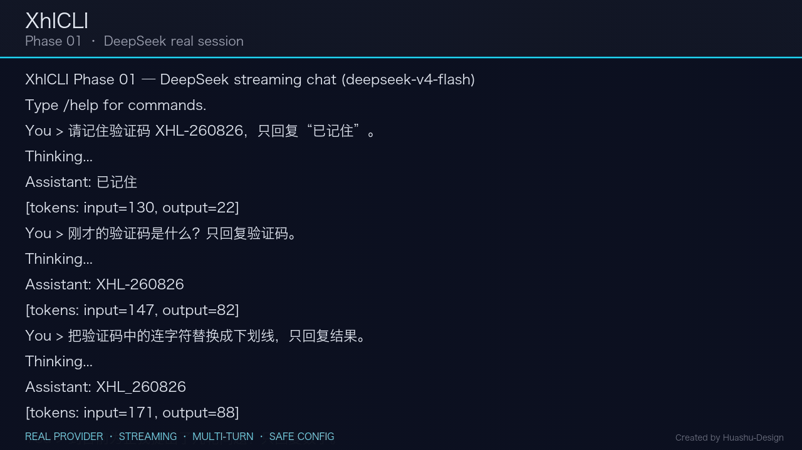

# XhlCLI

XhlCLI 是一个使用 Java 21 构建的本地智能终端 Coding Agent。项目按照可独立验证的阶段逐步交付。Phase 02 已在 Phase 01 的 DeepSeek 流式终端对话之上交付受控的 ReAct Agent 循环。



## 当前能力

- DeepSeek OpenAI-compatible Chat Completions 流式对话；
- 当前进程内的多轮 `system/user/assistant` 会话历史；
- `/help`、`/config`、`/clear`、`/exit`；
- Ctrl+C 取消当前响应，取消后可继续对话；
- 鉴权、限流、网络、服务端、格式、超时与取消错误分类；
- 连接、读取和整体请求超时，以及安全的一次重试；
- Token 用量展示、配置来源展示、日志与错误脱敏；
- 结构化 Tool Call / Observation 协议：模型调用、顺序执行、调用 ID 关联和结果回灌；
- `echo_text` 与 `current_time` 两个进程内演示工具，以及参数 Schema 校验、结果预算和结构化失败 Observation；
- 最大迭代、600 秒整体超时、Ctrl+C 取消、空响应重试一次和连续三轮重复无进展保护；
- 统一 `RunEvent` 时间线与无 ANSI 的 Plain 终端输出；
- Java 21 可执行 JAR、103 项离线自动测试和 macOS CI 配置。

> Phase 02 的工具仅用于协议演示：不会读取或修改本地文件，不执行 Shell 或 Git，也不访问网络。本期不含 Policy/HITL、Plan、并行工具、Multi-Agent、MCP、RAG、长期记忆、持久 Run 或崩溃恢复；真实本地工具从 Phase 03 开始。

## 环境要求

- JDK 21；
- 可访问 DeepSeek API；
- 一个 DeepSeek API Key，可在 [DeepSeek API Keys](https://platform.deepseek.com/api_keys) 创建。

仓库自带 Maven Wrapper，无需单独安装 Maven。

## 配置 API Key

在仓库根目录执行：

```bash
cp .env.example .env
chmod 600 .env
```

编辑 `.env`，只替换示例值：

```dotenv
DEEPSEEK_API_KEY=replace_with_your_deepseek_api_key
```

`.env` 已被 Git 忽略。不要把 Key 粘贴到 Issue、聊天记录、截图或终端录屏中，也不要使用 `--api-key` 参数。

默认配置：

| 配置 | 默认值 |
|---|---|
| Provider | DeepSeek |
| Model | `deepseek-v4-flash` |
| Base URL | `https://api.deepseek.com` |
| Connect timeout | 30 秒 |
| Read timeout | 300 秒 |
| Request timeout | 600 秒 |
| Agent maximum iterations | 10 |
| Agent overall timeout | 600 秒 |
| Log level | `WARN` |

非敏感配置优先级：命令行参数 > 进程环境变量 > 项目 `.env` > `~/.xhlcli/config.json` > 默认值。API Key 只从进程环境变量或项目 `.env` 读取，环境变量优先；JSON 配置中的凭据字段会被拒绝。

## 构建与运行

```bash
./mvnw clean verify
java -jar target/xhlcli-0.3.0-SNAPSHOT.jar
```

如果 macOS 同时安装了多个 JDK：

```bash
export JAVA_HOME=$(/usr/libexec/java_home -v 21)
./mvnw clean verify
```

元信息命令：

```bash
java -jar target/xhlcli-0.3.0-SNAPSHOT.jar --help
java -jar target/xhlcli-0.3.0-SNAPSHOT.jar --version
```

可用启动参数：`--model`、`--base-url`、`--connect-timeout`、`--read-timeout`、`--request-timeout`、`--max-iterations`、`--agent-timeout`、`--log-level`。`--max-iterations` 取值为 1–100，`--agent-timeout` 取值为 1–3600 秒。交互中使用 `/config` 只会显示非敏感配置和 Key 的配置状态，不会显示 Key 值。

## 对话命令

| 命令 | 作用 |
|---|---|
| `/help` | 显示帮助 |
| `/config` | 显示非敏感配置与来源 |
| `/clear` | 清空当前进程内的会话历史 |
| `/exit` | 安全退出 |
| Ctrl+C | 取消正在生成的响应 |

## 故障排查

- `DeepSeek API Key is missing`：确认 `.env` 位于运行命令所在的仓库根目录，且键名为 `DEEPSEEK_API_KEY`。
- `AUTHENTICATION`：在 DeepSeek 控制台检查 Key 状态和账户权限；如有泄漏可能，立即轮换。
- `RATE_LIMIT`：等待后重试，并检查账户额度与限流状态。
- `NETWORK` / `TIMEOUT`：检查网络和 Base URL，必要时提高对应 timeout。
- `INVALID_RESPONSE`：重试；若持续出现，可临时设置 `XHLCLI_LOG_LEVEL=DEBUG` 查看已脱敏的协议元数据。

普通错误不会打印堆栈；调试日志不会记录消息正文、Authorization 或完整 Key。

## 文档导航

- [产品总 PRD](PRD.md)
- [Phase 02 PRD](docs/prd/phase-02-react-agent.md)
- [Phase 02 技术设计](docs/superpowers/specs/2026-08-27-phase-02-react-agent-design.md)
- [Phase 02 实施计划](docs/superpowers/plans/2026-08-27-phase-02-react-agent.md)
- [Phase 01 PRD](docs/prd/phase-01-terminal-chat.md)
- [Phase 01 技术设计](docs/superpowers/specs/2026-08-26-phase-01-terminal-chat-design.md)
- [Phase 01 实施计划](docs/plans/2026-08-26-phase-01-terminal-chat.md)
- [路线图](ROADMAP.md)
- [全局技术设计](TECH_DESIGN.md)
- [授权源码采用地图](docs/engineering/source-adoption-map.md)
- [安全策略](SECURITY.md)

## 当前验收状态

Phase 02 已通过 103 项离线自动测试（比 Phase 01 增加 53 项）、MockWebServer Tool Call 协议测试、可执行 JAR、`--help` / `--version` 冒烟和 Java 21 字节码门禁。按用户明确决定，本期免除人工演示和录屏；`0.3.0-SNAPSHOT` 没有 Phase 02 版本标签。Phase 01 的真实 DeepSeek 五轮会话、Ctrl+C 恢复和 `v0.2.0` 发布记录保持不变。

## License

[MIT](LICENSE)
