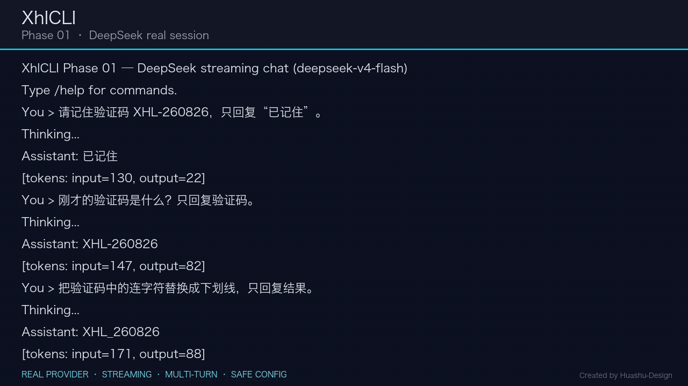

# XhlCLI

XhlCLI 是一个使用 Java 21 构建的本地智能终端 Coding Agent。项目按照可独立验证的阶段逐步交付。Phase 17 已完整交付后台持久任务/Localhost Runtime API 与图片多模态上下文预处理/视觉防御护栏。



## 当前能力

- 支持 OpenAI, Anthropic Claude, DeepSeek, Ollama 等多模型 Provider 协议路由；
- 图片多模态上下文预处理与视觉防御护栏（`@image:<path>`, `@clipboard`，Alpha Flatten 白底合成防穿透、2000x2000 等比缩放、5MB 阈值压缩、坐标换算元信息注入、非视觉模型防 400 纯文本降级）；
- 后台持久任务队列与 Localhost 安全 Runtime API（SQLite 事务原子调度、孤儿租约自愈、127.0.0.1 严格绑定与 API Key 拦截、游标 SSE 事件流）；
- Side-History 隔离快照与版本回滚（JGit 纯 Java 隔离存储、宿主 Git 零污染、`revert_turn` 自愈工具与 `/snapshot` `/restore`）；
- 终端产品化与交互治理（JLine 4 动态状态栏、WCWidth 精准对齐、Markdown 表格与代码框排版、Git Diff 语法着色、SafeHistory 历史治理与 Tab 智能补全）；
- Skill 与 Prompt 分层治理（8 层确定性装配、安全规则不可变、按需动态加载）；
- Web 检索与浏览器沙箱（SSRF 安全围栏、多搜索引擎统一抽象、5MB 受限正文抽取、CDP 浏览器控制与敏感页审批）；
- MCP 生态扩展（JSON-RPC 2.0、Stdio/SSE 传输、两级配置合并、命名空间隔离）；
- Multi-Agent 专职协作架构（Planner / Worker 池 / Reviewer 最小上下文交接与审查打回熔断）；
- 有界并发执行调度与 DAG 规划执行（Bounded Parallelism、Kahn 分层批次）；
- 嵌入式 SQLite AST 代码库检索与 RAG 语义索引；
- 受控 ReAct 循环、9 个本地工具、安全围栏与人工审批 (HITL)；
- Java 21 可执行 JAR、522 项离线自动测试和 CI 配置。

## 环境要求

- JDK 21；
- 可访问 DeepSeek API；
- 一个 DeepSeek API Key，可在 [DeepSeek API Keys](https://platform.deepseek.com/api_keys) 创建。

仓库自带 Maven Wrapper，无需单独安装 Maven。

## 配置 API Key

在仓库根目录执行：

```bash
cp .env.example .env
chmod 600 .env
```

编辑 `.env`，只替换示例值：

```dotenv
DEEPSEEK_API_KEY=replace_with_your_deepseek_api_key
```

`.env` 已被 Git 忽略。不要把 Key 粘贴到 Issue、聊天记录、截图或终端录屏中，也不要使用 `--api-key` 参数。

默认配置：

| 配置 | 默认值 |
|---|---|
| Provider | DeepSeek |
| Model | `deepseek-v4-flash` |
| Base URL | `https://api.deepseek.com` |
| Connect timeout | 30 秒 |
| Read timeout | 300 秒 |
| Request timeout | 600 秒 |
| Agent maximum iterations | 10 |
| Agent overall timeout | 600 秒 |
| Log level | `WARN` |

非敏感配置优先级：命令行参数 > 进程环境变量 > 项目 `.env` > `~/.xhlcli/config.json` > 默认值。API Key 只从进程环境变量或项目 `.env` 读取，环境变量优先；JSON 配置中的凭据字段会被拒绝。

## 构建与运行

```bash
./mvnw clean verify
java -jar target/xhlcli-0.15.0-SNAPSHOT.jar
```

如果 macOS 同时安装了多个 JDK：

```bash
export JAVA_HOME=$(/usr/libexec/java_home -v 21)
./mvnw clean verify
```

元信息命令：

```bash
java -jar target/xhlcli-0.15.1-SNAPSHOT.jar --help
java -jar target/xhlcli-0.15.1-SNAPSHOT.jar --version
```

可用启动参数：`--model`、`--base-url`、`--connect-timeout`、`--read-timeout`、`--request-timeout`、`--max-iterations`、`--agent-timeout`、`--log-level`。`--max-iterations` 取值为 1–100，`--agent-timeout` 取值为 1–3600 秒。交互中使用 `/config` 只会显示非敏感配置和 Key 的配置状态，不会显示 Key 值。

## 对话命令

| 命令 | 作用 |
|---|---|
| `/help` | 显示帮助信息 |
| `/config` | 显示非敏感配置与来源 |
| `/clear` | 清空当前进程内的会话历史 |
| `/plan [goal]` | 触发 DAG 拓扑分层规划与受控执行 |
| `/team <goal>` | Multi-Agent 协作团队执行任务（Planner + Workers + Reviewer） |
| `/model [list\|use\|status]` | 模型与 Provider 动态切换管理 |
| `/mcp [list\|status\|tools\|resources\|read\|restart]` | MCP 外部工具与资源协议管理 |
| `/browser [status\|connect\|disconnect\|tabs]` | 浏览器沙箱与 CDP 宿主连接控制台 |
| `/skill [list\|show\|enable\|disable\|reload]` | 可复用工程技能与工作流管理 |
| `/prompt [show\|export]` | 查看或脱敏导出分层系统提示词与审计信息 |
| `/history [list\|clear]` | 查看安全历史记录或清空持久化历史 |
| `/snapshot [status\|clean]` | Side-Git 隔离快照状态、历史列表与重置 |
| `/restore [N]` | 恢复回滚至指定轮次开始前状态（默认 N=1） |
| `/task [list\|add\|log\|cancel]` | 后台持久任务队列与执行状态管理 |
| `/exit` | 安全退出 |
| Ctrl+C | 取消正在生成的响应 |

## 故障排查

- `DeepSeek API Key is missing`：确认 `.env` 位于运行命令所在的仓库根目录，且键名为 `DEEPSEEK_API_KEY`。
- `AUTHENTICATION`：在 DeepSeek 控制台检查 Key 状态和账户权限；如有泄漏可能，立即轮换。
- `RATE_LIMIT`：等待后重试，并检查账户额度与限流状态。
- `NETWORK` / `TIMEOUT`：检查网络和 Base URL，必要时提高对应 timeout。
- `INVALID_RESPONSE`：重试；若持续出现，可临时设置 `XHLCLI_LOG_LEVEL=DEBUG` 查看已脱敏的协议元数据。

普通错误不会打印堆栈；调试日志不会记录消息正文、Authorization 或完整 Key。

## 文档导航

- [项目全局定位与资产映射 (Vibe Document Map)](docs/PROJECT.md)
- [产品总 PRD](docs/PRD.md)
- [路线图与交付状态](docs/ROADMAP.md)
- [真实技术架构基线](docs/TECH_DESIGN.md)
- [技术方案设计规范索引 (Specs)](docs/specs/README.md)
- [实施路线任务清单索引 (Plans)](docs/plans/README.md)
- [立项需求研究](docs/RESEARCH.md)
- [授权源码采用地图](docs/engineering/source-adoption-map.md)
- [Phase 17A 后台任务与 Runtime API 评测报告](docs/engineering/runtime-and-task-evaluation.md)
- [Phase 16 隔离快照与版本恢复评测报告](docs/engineering/snapshot-and-recovery-evaluation.md)
- [Phase 15 终端产品化与交互治理评测报告](docs/engineering/terminal-productization-evaluation.md)
- [Phase 14 Skill 与 Prompt 分层治理评测报告](docs/engineering/skill-and-prompt-evaluation.md)
- [Phase 13 Web 与浏览器评测报告](docs/engineering/web-and-browser-evaluation.md)
- [Phase 12 MCP 扩展评测报告](docs/engineering/mcp-evaluation.md)
- [Phase 11 多模型评测报告](docs/engineering/multi-model-evaluation.md)
- [Phase 10 Multi-Agent 评测报告](docs/engineering/multi-agent-evaluation.md)
- [Phase 09 并行执行评测报告](docs/engineering/parallel-execution-benchmark.md)
- [Phase 08 规划与执行评测报告](docs/engineering/plan-and-execute-evaluation.md)
- [Phase 07 代码库 RAG 评测报告](docs/engineering/codebase-rag-evaluation.md)
- [安全策略](SECURITY.md)

## 当前验收状态

Phase 02 已通过 127 项离线自动测试（比 Phase 01 增加 77 项）、MockWebServer Tool Call 协议测试、可执行 JAR、`--help` / `--version` 冒烟和 Java 21 字节码门禁。按用户明确决定，本期免除人工演示和录屏；`0.3.0-SNAPSHOT` 没有 Phase 02 版本标签。Phase 01 的真实 DeepSeek 五轮会话、Ctrl+C 恢复和 `v0.2.0` 发布记录保持不变。

## License

[MIT](LICENSE)
